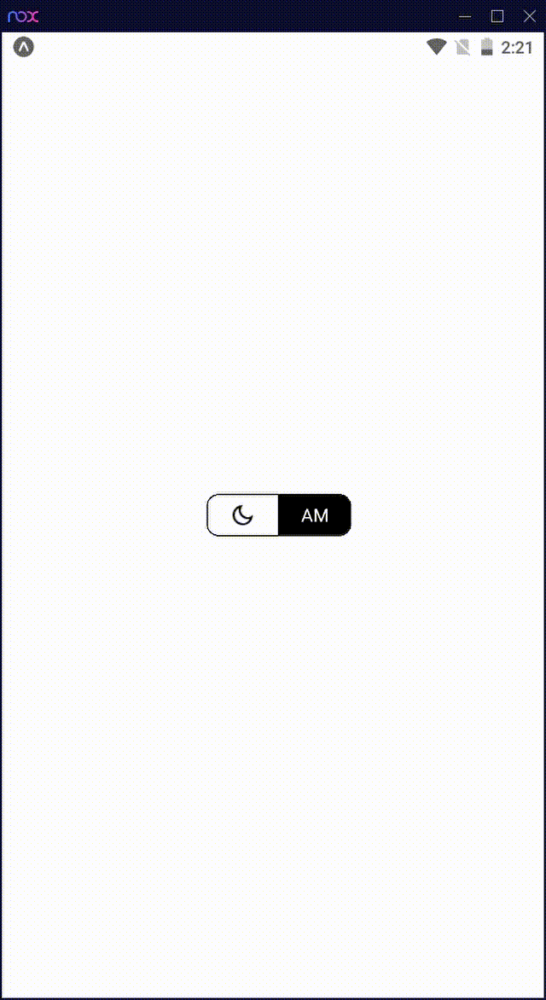

Time Switch Component for react native, it works on Android, iOS and Web (react-native-web).

## Content

- [Installation](#installation)
- [Demo](#demo)
- [Getting started](#getting-started)
- [API](#api)
- [Contribution](#contribution)

## Installation

If you're using npm

- Using npm

```bash
npm i time-switch-react-native --save
```

- Using yarn

```bash
yarn add time-switch-react-native --save
```

- Import it into your project

```bash
import TimeSwitch from "time-switch-react-native";
```

## Demo



## Getting started

To Get Started, Import `time-switch-react-native` to your .js/.ts/.tsx/.jsx file.

`import TimeSwitch from 'time-switch-react-native'`

Inside your component's render method, or any other method returning views, use TimeSwitch:

```javascript
<TimeSwitch />
```

## Contribution

If you encountered an Issue, please add a screenshot of the bug or a code snippet.

Quickest way to solve issue is to reproduce it on the example project

Pull requests are welcome. If you want improve something, feel free to create an issue and discuss it first.

---

**MIT Licensed**
